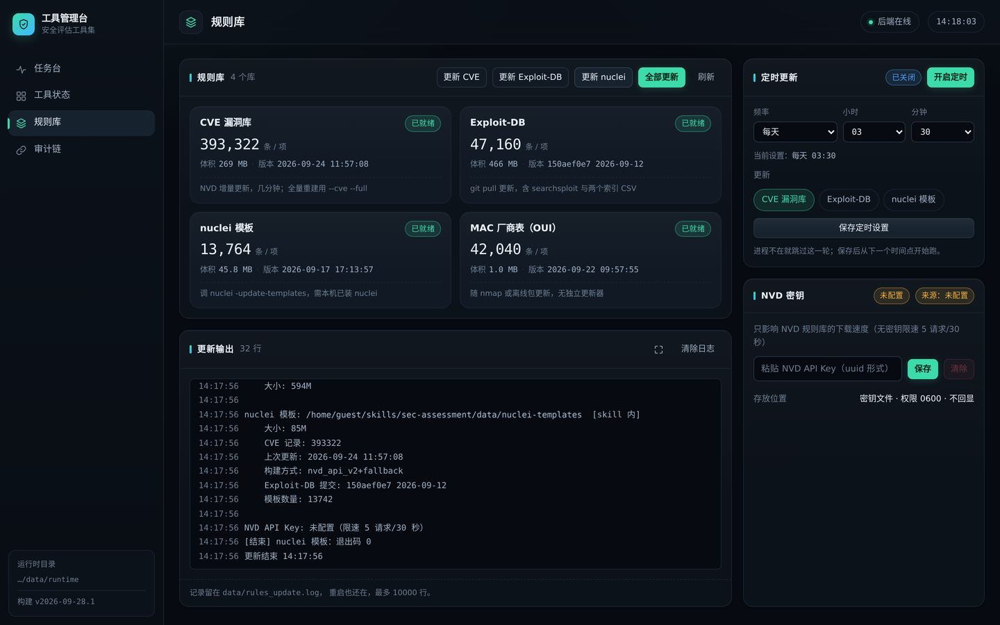
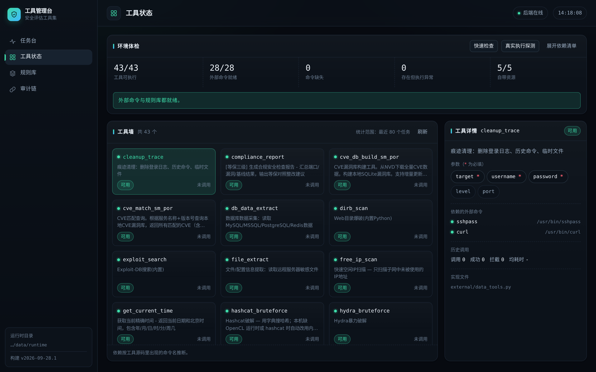

# sec-assessment — 授权目标安全评估 Skill

> 给 AI Agent 用的一体化安全评估技能包：43 个本地安全工具 + 一条
> 「判定 → 执行 → 复核 → 交叉验证 → 报告」的编排链。
> 用自然语言描述任务，产出 HTML / PDF / Word / Markdown / JSON 五份同源报告。

> ⚠️ **仅限已获授权的目标。** 授权范围不明确时，编排链会先反问，不会猜一个地址就扫。

---

## 一、这个 skill 是干什么的

扫描器本身不稀缺，稀缺的是"**会正确使用扫描器的 Agent**"。把 nmap、nuclei、sqlmap、hydra
这类工具直接交给一个语言模型，通常会得到三种结果：选错工具、参数瞎写、把原始输出原样贴给用户。

`sec-assessment` 把这三种情况分别堵掉。参数不靠模型记忆：43 个工具每个都带 schema
（必填/可选、类型），模型只出"意图 + 参数"，实际调用由 `executor` 按 schema 收口。
扫什么、按什么顺序也不靠模型即兴发挥：`planner` 把自然语言任务翻成有序步骤，并按目标
形态过滤，目标是网段时那些需要站点 URL 的工具自动不参与。误报有三道闸：扫描输出先经
`critic` 收敛定级，再由 `verifier` 拿同一批原始输出交叉验证，被推翻的条目照样列在报告
附录里。最后 `reporter` 出五份同源报告，含风险图表、模型用量和算力环境归因，
不用人再对着终端抄一遍。

---

## 二、核心能力

43 个安全工具，覆盖资产发现、端口与服务识别、Web 漏洞扫描、CVE 匹配与验证、口令审计、
内网横向、等保合规七类，完整清单见第六节。

编排链是 `planner → executor → critic → verifier → reporter` 五环，跑在同一个进程里，
由 `runner` 顺序驱动。每个环节可以单独指定模型后端和模型名（本机 vLLM、任意 OpenAI
兼容端点、阶跃星辰 StepFun 都行），某一环探不通时只有那一环退回规则实现，整轮不中断 ——
现场模型没起也能出完整报告，只是判定深度差一些。

报告一次出五份：HTML 是自包含单文件、可直接打印，PDF 交付用，Word 要改内容时用，
Markdown 归档，JSON 给工单系统；五份同一批数据和图表，不会出现两份报告数字对不上。
每次工具调用都写进运行轨迹和审计链，报告附录可以逐条回溯。

具备利用、横向、凭据窃取能力的工具（`[risky]`）不会自己进计划，只在用户明确点名时才执行，
并且计划、轨迹、报告里都会带标注。第三方 Python 依赖只有 `dirb_scan` 需要的 `requests`，
而且可以不装。

---

## 三、环境要求

| 项 | 要求 |
|---|---|
| 操作系统 | Linux（openEuler 24.03 / Ubuntu 22.04 实测） |
| Python | 3.10+（标准库为主） |
| Agent 宿主 | 支持 Agent Skills 的宿主均可，如 Claude Code、Codex CLI、WorkBuddy；亦可直接用命令行驱动 |
| 算力平台 | NVIDIA DGX Spark（GB10）· 本机 vLLM 推理 · CUDA 13.0；没有 GPU 时全链退回规则实现，照样跑通 |
| 可选 | `pip install requests`（仅 `dirb_scan` 需要） |

外部二进制**按需安装**，用不到的工具缺依赖不影响其余功能。常用：

```bash
# Debian/Ubuntu
sudo apt-get install -y nmap masscan nikto sqlmap hydra hashcat smbmap
# openEuler / RHEL
sudo dnf install -y nmap nikto hydra
# nuclei（单二进制）
go install -v github.com/projectdiscovery/nuclei/v3/cmd/nuclei@latest
```

装完自检，缺什么它会给出对应的安装命令：

```bash
python3 scripts/check_deps.py            # 存在性 + 真实执行探测
python3 scripts/check_deps.py --no-smoke # 只查存在性，更快
```

---

## 四、部署

### 4.1 安装到 Agent 的 skills 目录

```bash
git clone https://github.com/Upstream-Boat/Aiaiop.git
cd Aiaiop

./install.sh                     # 默认装到 ~/.codex/skills/sec-assessment
./install.sh --link              # 软链接方式（省空间，改代码即时生效）
./install.sh ~/.claude/skills    # 指定 skills 根目录（Claude Code）
./install.sh <宿主 skills 根目录> # 其它宿主（WorkBuddy 等）同理
```

`install.sh` 只复制 skill 本体，不触碰系统其它位置。各家宿主认的都是同一份
`SKILL.md` + `scripts/`，装到哪儿内容一致，换个宿主不用改代码。

### 4.2 拉取规则库（首次必做）

仓库**不含**三套大规则库（合计约 650MB，见 `data/README.md`）：

```bash
python3 scripts/update_rules.py --all       # CVE 库 + Exploit-DB + nuclei 模板
python3 scripts/update_rules.py --status    # 只看当前版本，不联网
```

也可以只拉需要的：`--cve` / `--exploit-db` / `--nuclei`。
没有这三套库时，`cve_match_sm_por` / `exploit_search` / `nuclei_scan` 不可用，其余工具照常。

### 4.3 离线自检（不需要网络，也不需要目标机）

```bash
python3 evals/smoke.py
```

覆盖工具注册表、参数 schema、判定路由、报告渲染等；**不需要任何真实目标**，装完先跑这个。

### 4.4 完整性校验（可选）

```bash
sha256sum -c MANIFEST.sha256     # 104 个文件逐个校验（skill 本体）
```

> `MANIFEST.sha256` 覆盖 skill 本体（`SKILL.md` / `scripts/` / `references/` /
> `evals/` 等 104 个文件）；`console/` 是配套的管理台，不参与 skill 指纹。

### 4.5 起管理台（可选）

```bash
pip install fastapi uvicorn pydantic
python3 console/server/app.py --port 8787                  # 只有本机能访问
python3 console/server/app.py --host 0.0.0.0 --port 8787   # 演示机 / 局域网可访问
```

浏览器打开 `http://<地址>:8787/`。四个页签：**任务台**（实时看编排链跑到哪一步）、
**工具状态**（43 个工具的依赖与可用性）、**规则库**（三套库的版本与更新）、
**审计链**（哈希链校验，含「篡改 → 校验失败 → 还原」的现场演示）。
详见 `console/README.md`。

**规则库** —— 四套库的条数、体积、版本一屏看完，可单库更新、全部更新或挂定时任务，
更新输出实时落到日志：



**工具状态** —— 43 个工具是否可用、依赖的外部命令是否就位、每个工具的参数与实现文件：



### 4.6 在 DGX Spark 上部署（本地算力）

模型推理跑在 **NVIDIA DGX Spark**（GB10 超级芯片，统一内存架构）本机的 vLLM 上；
工具执行、编排与报告渲染跑在一台 x86_64 执行机上 —— 扫描器、字典、报告渲染这些
吃磁盘和进程的活儿不挤占 Spark 的显存。

```text
      DGX Spark（GB10）                      x86_64 执行机（openEuler 24.03）
┌────────────────────────────┐        ┌───────────────────────────────────────┐
│ vLLM · OpenAI 兼容端点      │        │ skill-bisai 编排链 + 43 个本地工具      │
│ 127.0.0.1:8000/v1          │◀─SSH──▶│ 本地回环 127.0.0.1:11435/v1            │
│ Nemotron 系列开源模型（NVFP4）│  隧道   │ （后端名 spark-local）                 │
└────────────────────────────┘        └───────────────────────────────────────┘
```

实测环境 —— 下表每个数字都由 `scripts/llm/gpu.py` 在真实任务里采样得到，
并写进报告的「算力环境」一栏，不是文档里的一句"用了 GPU"：

| 项 | 实测值 |
|---|---|
| 加速卡 | NVIDIA GB10（DGX Spark，统一内存架构） |
| 驱动 / CUDA | 580.142 / CUDA 13.0 |
| 本机推理 | vLLM（计算进程名 `VLLM::EngineCore`），OpenAI 兼容端点，只监听本机 |
| 推理进程实占显存 | ≈ 100.5 GB（GB10 上设备级 `memory.total` / `memory.used` 返回 N/A，故按计算进程累加） |
| 采样到的峰值 | GPU 利用率 96%，功耗约 34–38 W |

部署三步：

```bash
# 1) Spark 上起 vLLM（OpenAI 兼容），端点只监听本机，默认 127.0.0.1:8000/v1
# 2) 执行机建一条 SSH 隧道，把 Spark 的 8000 映射到本机 11435
ssh -N -L 11435:127.0.0.1:8000 <user>@<spark-host> -p <port> -i ~/.ssh/<key>
# 3) 指给编排链：spark-local 后端的默认端点就是 127.0.0.1:11435/v1
python3 scripts/agents/runner.py "对 192.168.x.x 做一次端口与服务识别" --backend spark-local
```

> 隧道建议由脚本 `exec ssh` 拉起，别直接写进 systemd 的 `ExecStart=ssh`：
> 后者进程落在 `init_t` 域，openEuler 的 SELinux 策略不允许它执行 `ssh_exec_t`（报 203/EXEC）；
> 经脚本 `exec` 后落在 `initrc_t`，策略放行。推理与执行同机时不需要隧道。

算力归因的取数按可用性依次退让，全程只读、不改对方机器：

1. 本机 `nvidia-smi`（NVML 的命令行前端，随驱动自带）—— 推理与执行同机时走这条；
2. `GPU_METRICS_SSH` —— 远程跑同一条命令，**不需要在 Spark 上装任何常驻服务，也不暴露端口**；
3. `GPU_METRICS_URL` —— 可选的只读 HTTP 指标端点（`scripts/gpu_metrics_server.py`，强制 token、默认只听本机）。

取不到的字段一律留空，**不编数**。

### 4.7 模型接入与优化

三个后端共用一套 OpenAI 兼容协议，可整体切，也可**逐环节**指定：

| 后端 | 用途 | 端点 / 密钥 |
|---|---|---|
| `spark-local` | 本地算力，DGX Spark 本机 vLLM | `SPARK_LLM_BASE_URL`（默认 `http://127.0.0.1:11435/v1`） |
| `stepfun` | 阶跃星辰 StepFun | `STEPFUN_BASE_URL` / `STEPFUN_API_KEY` |
| `gpustack` | 内网联调 | `GPUSTACK_BASE_URL` / `GPUSTACK_API_KEY` |

**逐环节换模型**，让判定与复核由不同模型交叉验证：

```bash
python3 scripts/agents/runner.py "..." --planner-backend spark-local \
    --critic-backend stepfun --critic-model step-3.7-flash
```

围绕"本地模型当判定大脑"这几件事做了几处工程处理。降级是单点的：某个环节探不通模型
（端点没起、密钥不对、超时），只有它退回规则实现，其余环节照常调模型，任务不中断，
降级在轨迹里显式标注而不是静默处理。本地模型常出现"JSON 后面再跟一句解释"，输出解析
改成只取第一个完整 JSON 对象，避免整份判定被丢掉后退回规则实现；判定提示词也换成真实
工具名并注明只是格式示意，planner 加了工具名校验，critic 会丢弃没有证据支撑的条目。
用量按 OpenAI 兼容网关的 usage 字段逐请求统计，每轮把 prompt / completion / total 与
命中的后端、模型名写进轨迹和报告；网关如果回占位值 `1/1/1` 就直接丢弃，不当真实用量。
模型调用前后还会采样 GPU 利用率、功耗、温度和推理进程显存，一并写进报告。

---

## 五、怎么用

### 5.1 一条指令跑完整评估（推荐）

```bash
python3 scripts/agents/runner.py "对 192.168.x.x 做一次开放端口与服务巡检，并生成报告"
```

常用开关：

| 开关 | 作用 |
|---|---|
| （默认） | 逐行打印进度，宿主可据此实时显示过程 |
| `--quiet` | 只输出总结 |
| `--dry-run` | 只做判定、不执行，用来核对"它打算怎么扫" |
| `--no-model` | 不用模型，走规则判定 |
| `--backend spark-local` | 指定判定模型后端 |

单个环节换模型（配 `-model` 一起用）：

```bash
python3 scripts/agents/runner.py "..." --critic-backend stepfun --critic-model step-3.7-flash
```

### 5.2 调用单个工具

```bash
python3 scripts/call.py --list                                  # 列出 43 个工具
python3 scripts/call.py ping_scan target=192.168.x.0/24
python3 scripts/call.py service_identify target=192.168.x.x:22,192.168.x.x:443
python3 scripts/call.py cve_match_sm_por service=nginx version=1.18.0
```

直调同样会写进运行轨迹与审计链；确认不需要记录时加 `--no-record`。

### 5.3 在 Agent 里用

把 skill 装到宿主 skills 根目录后（Claude Code / Codex CLI / WorkBuddy 等皆可），
Agent 依据 `SKILL.md` 的 `description` 自动触发。
给 Agent 的自然语言指令，例如：

> 对 192.168.x.0/24 做一次网段巡检，看看有哪些在线设备、开了什么端口，
> 对可疑服务做 CVE 匹配，最后生成报告。

### 5.4 报告在哪

```
data/runtime/reports/<run_id>/
├── report.html    # 主件，自包含单文件，浏览器直接打开 / 可直接打印
├── report.pdf     # 交付用
├── report.docx    # 要改内容时用
├── report.md      # 归档 / 工单系统
└── report.json    # 机器可读
```

报告含 4 张图表（主机风险、风险等级分布、按类型 / 按工具的堆叠图），
以及「模型用量」与「算力环境」两栏归因。

---

## 六、工具清单（43）

**资产发现与网段**

| 工具 | 用途 |
|---|---|
| `ping_scan` | 网段存活探测（nmap -sn，不回应 ICMP 的主机自动 -Pn 重探） |
| `free_ip_scan` | 只找子网里**未被使用**的 IP |
| `ip_usage_report` | 网段使用情况报告：在线设备 + 设备类型/厂家 + 空闲 IP |
| `network_survey` | 大网段快速普查（/16 及以上），不逐个扫端口 |
| `lateral_portscan` | 内网存活主机快速探测 |

**端口与服务识别**

| 工具 | 用途 |
|---|---|
| `masscan_scan` | 单 IP / IP 列表的**全端口**（65535）扫描 |
| `network_inspect` | 内网巡检：在线设备、设备分类、端口/服务、MAC 厂商、空闲 IP，可选 SSH 深度采集 |
| `service_identify` | IP:端口 → 服务名与版本号（批量按 IP 分组） |
| `os_identify` | 设备类型深度指纹（路由器 / 交换机 / 防火墙 / NAS / 服务器 / 容器…） |

**Web 漏洞**

| 工具 | 用途 |
|---|---|
| `nuclei_scan` | 专业漏洞扫描（1.3 万+ 模板，覆盖 CVE / 高危 / 应用类） |
| `nikto_scan` | Web 服务扫描 |
| `waf_detect` | WAF / IDS / IPS 识别（wafw00f） |
| `dirb_scan` | Web 目录爆破（内置字典，需 `requests`） |
| `subdomain_enum` | 子域名枚举（API 聚合 + DNS 爆破双引擎） |
| `sqlmap_basic` | SQL 注入检测（GET） |
| `sqlmap_full` | SQL 注入全功能（POST / Header / Cookie，高级选项默认关闭、按需开启） |

**CVE 匹配与验证**

| 工具 | 用途 |
|---|---|
| `cve_match_sm_por` | 服务 + 版本 → 本地 CVE 库匹配（CVSS、描述、修复建议） |
| `cve_db_build_sm_por` | 从 NVD 构建 / 增量更新本地 CVE 库 |
| `poc_runner_sm_por` | 指定 CVE + 目标的 PoC 自动验证（nuclei / msf / searchsploit / 公开 PoC） |
| `vuln_verify` | 漏洞真实性复现，排误报 |
| `exploit_search` | Exploit-DB 检索（内置 4.7 万条） |

**口令审计**（`[risky]`）

| 工具 | 用途 |
|---|---|
| `hydra_bruteforce` | 在线口令爆破 |
| `hashcat_bruteforce` | 哈希爆破；无 OpenCL / hashcat 时自动回退内置 CPU 实现 |
| `passwd_dict_gen` | 按目标信息（公司名 / 姓名 / 年份）生成弱口令字典 |

**内网横向与后渗透**（`[risky]`）

| 工具 | 用途 |
|---|---|
| `lateral_smb_enum` / `smb_enum` | SMB 枚举：共享、用户、空会话 |
| `impacket_smbexec` | SMB 远程命令执行 |
| `impacket_secretsdump` | NTDS 哈希导出 |
| `lateral_hash_dump` | 从 `/etc/shadow` 或 SAM 提取哈希 |
| `mimikatz_memory` | Windows 内存凭据提取 |
| `kerberos_attack` | AS-REP Roasting + Kerberoasting |
| `lateral_redis_backdoor` | Redis 未授权 + SSH 公钥植入 |
| `lateral_ssh_exec` | 已持凭据的 SSH 远程执行 |
| `db_data_extract` | MySQL / MSSQL / PostgreSQL / Redis 数据读取 |
| `file_extract` | 远程敏感文件 / 配置读取 |
| `socks_proxy` | Chisel 反向隧道 / SOCKS5 代理 |
| `revshell_handler` | 反弹 Shell 监听 |
| `msf_exploit` | 按漏洞名匹配并执行 MSF 模块 |
| `msfvenom_payload` | 生成 MSF payload |
| `persist_install` | 权限维持（公钥 / cron / systemd / bashrc） |
| `cleanup_trace` | 痕迹清理 |

**等保合规 / 辅助**

| 工具 | 用途 |
|---|---|
| `compliance_report` | 等保三级对照检查报告与整改建议 |
| `get_current_time` | 当前时间（报告时间戳用） |

---

## 七、编排链

```
                任务原文（自然语言）
                        │
          ┌─────────────▼─────────────┐
          │  planner  判定：目标 + 步骤  │  ← 目标缺失 → needs_clarification，停下反问
          └─────────────┬─────────────┘
                        │  有序步骤（工具名 + schema 收口后的参数）
          ┌─────────────▼─────────────┐
          │  executor 执行：按步调用工具 │  ← 每步留痕（轨迹 + 审计链）
          └─────────────┬─────────────┘
                        │  原始输出
          ┌─────────────▼─────────────┐
          │  critic   收敛定级          │
          └─────────────┬─────────────┘
                        │
          ┌─────────────▼─────────────┐
          │  verifier 交叉验证 / 排误报 │  ← 被推翻的条目进报告附录
          └─────────────┬─────────────┘
                        │
          ┌─────────────▼─────────────┐
          │  reporter 出五份同源报告    │
          └───────────────────────────┘
```

各环节独立调模型，可分别指定后端；探不通模型时只有该环节退回规则实现。

---

## 八、技术栈

| 层 | 用了什么 |
|---|---|
| 硬件平台 | NVIDIA DGX Spark —— GB10 超级芯片，统一内存架构 |
| NVIDIA 技术栈 | NVML / `nvidia-smi`（每轮采样算力归因）、CUDA 13.0（驱动 580.142）、DGX Spark 平台上的 vLLM 推理 |
| 本地开源模型 | vLLM 加载的 Nemotron 系列开源模型（NVFP4 量化），OpenAI 兼容端点 |
| Agent 宿主 | Claude Code / Codex CLI / WorkBuddy 等 Agent Skills 宿主；也可命令行直驱 |
| Skill 规范 | `SKILL.md`（frontmatter: name / description / license / version）+ 渐进式披露的 `references/` |
| 编排 | 纯 Python 顺序驱动五环节，各环节独立选模型 |
| 模型接入 | 本机 vLLM（OpenAI 兼容）、任意 OpenAI 兼容端点、阶跃星辰 StepFun（`step-3.7-flash`，Anthropic 兼容 `/step_plan`） |
| 安全工具 | nmap / masscan / nuclei / nikto / sqlmap / hydra / hashcat / wafw00f / smbmap / Impacket / MSF 等 |
| 规则库 | 本地 SQLite（NVD CVE 39.3 万条）+ Exploit-DB 4.7 万条 + nuclei 模板 1.3 万+ |
| 控制台 | FastAPI + uvicorn 后端；Vue 3 前端（本地自带运行时，零构建、零 CDN） |
| 报告 | 自包含 HTML（含图表）→ PDF / DOCX / Markdown / JSON 五份同源 |
| 留痕 | 运行轨迹 + 审计链，报告附录可回溯 |

---

## 九、安全边界

- **只对已授权目标操作。** 目标（IP / CIDR / 站点 URL）缺失或不在授权范围内时，链会返回
  `needs_clarification` 并停下，不猜测。
- **高风险工具显式点名才进计划**，并在计划、轨迹、报告里统一标注 `[risky]`。
- **结果先复核再交付**：判定与复核由不同环节独立完成，被推翻的条目在报告附录列明。
- **不采集凭据用于外发**：所有命令输出只落在本机 `data/runtime/`。
- **规则库只写自己的 `data/`**：`update_rules.py` 启动时会校验写入目标，
  任何指向 skill 之外的路径直接拒绝执行。
- **凭据不分发**：仓库不含任何 API key / 口令；`data/nvd_api_key.txt` 已进 `.gitignore`。
  仓库中的示例一律是占位符（如 `<token>`）。

---

## 十、评测

- `BENCHMARK.md` 是冻结的评测协议（改动需显式说明）。
- `evals/` 提供可复现用例，**包含负向用例**（正确答案是"不该调用本 skill"的场景），
  以及 `evals/smoke.py` 离线自检。
- `evals/agent-results/` 保留了几轮 Agent 实测结果。

> 文档与示例里的目标地址统一写成 `192.168.x.x` 占位形式，代码与评测数据里用
> `192.168.1.x` 这类通用内网地址；原始环境信息已脱敏。

```bash
python3 evals/smoke.py            # 离线自检
python3 evals/run.py              # 跑评测集
```

---

## 十一、许可

本项目采用 **Apache-2.0**，全文见 `LICENSE`。

仓库内随附的第三方内容，以及部署时按需下载的规则库，各自遵循其上游许可，详见 `NOTICE`。

**使用限制**：本项目是安全评估工具，**仅可用于已获授权**的目标。对未授权系统做扫描、爆破或
利用可能触犯法律，授权范围由使用者自行确认。

---

## 十二、免责声明

- 本项目面向**已获授权目标**的安全评估。使用前请自行确认授权范围、适用法律与合规要求，
  对自己的行为及其后果负责。
- **严禁**将本项目用于任何未授权或违法的场景，包括但不限于：未授权扫描探测、入侵控制、
  数据窃取、干扰或破坏计算机信息系统、侵害他人合法权益。
- 使用者因使用本项目产生的一切后果与法律责任，**由其本人承担**；作者与贡献者不参与、
  不认可、亦不承担任何连带责任。
- 本项目按 Apache-2.0 **「现状」** 提供，不含任何明示或默示担保（见 `LICENSE` 第 7、8 条）。
